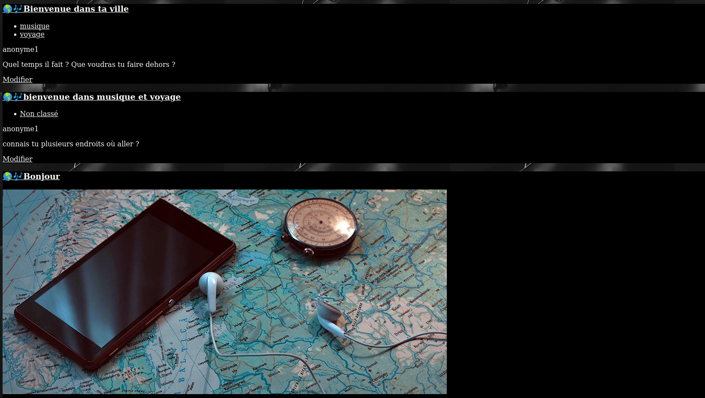
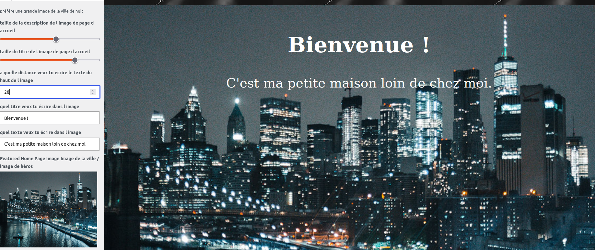
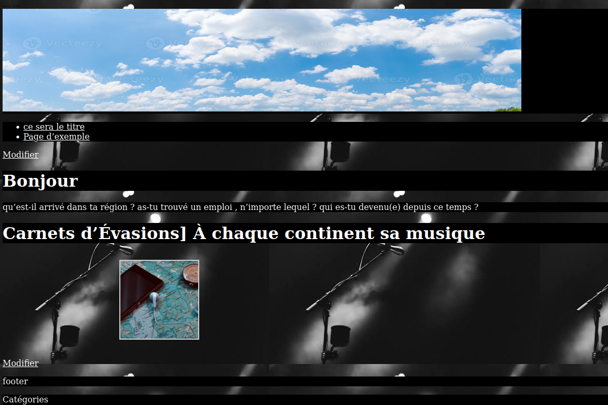

- fais cd /srv/www/wordpress/wp-content/themes/ && git clone my-second-theme
- fais cd /srv/www/wordpress/wp-content/themes/my-second-theme
- avant de commencer fais cp class-wp-widget-factory.php ../../../wp-includes/ 
- tu peux personnaliser l'image d'entete,l'image d'arriere plan, les menus, les reglades de la page d'accueil, et un css personnalisé

