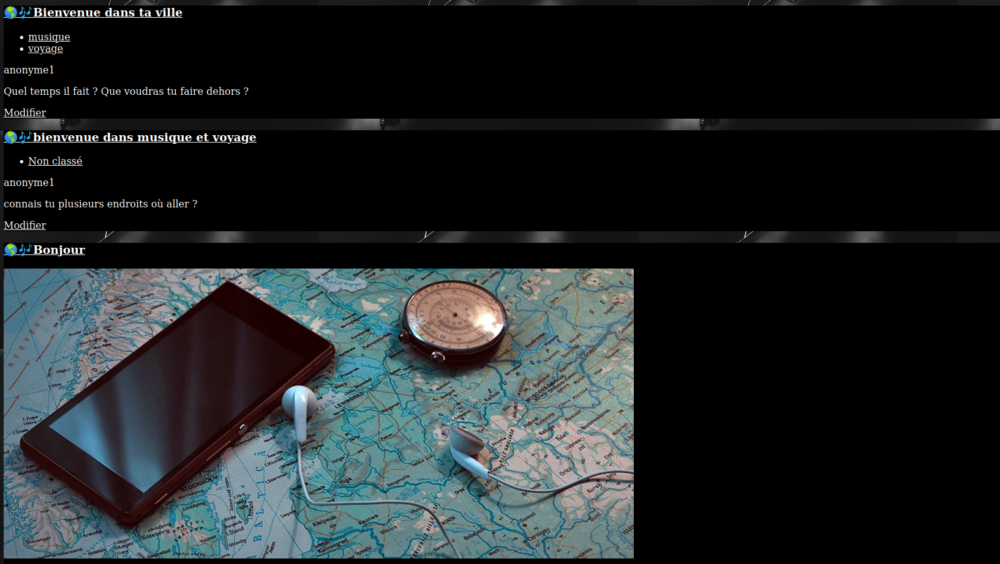
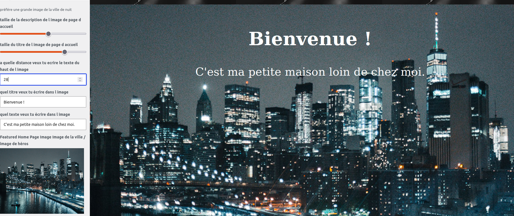
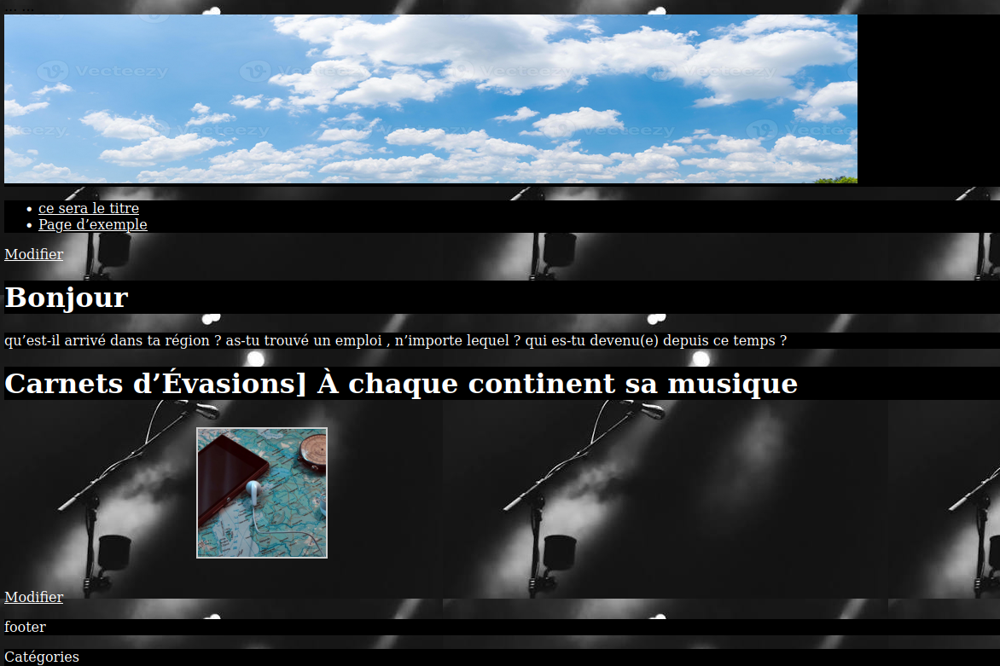

# Bienvenue dans voyage et musique, le thème classique Wordpress job-ready :airplane: :musical_note:

- les instructions exactes du README de ce repository sont pour linux :computer: mais elles peuvent marcher aussi pour windows ou mac :computer: si tu places bien le plugin pour faire fonctionner le thème
- ce thème fonctionnera peut-être mieux si tu gardes "voyage" et "musique" comme les deux catégories pour classer les articles  du thème
- il faut installer Lilypond si tu veux pouvoir envoyer un email avec la fonction de musique ajoutée

Bienvenue dans ce thème wordpress
-

### Dans ce thème, grâce à du code PHP, tu peux :
- personnaliser les couleurs de liens, des titres, du text, le fond du texte, l'image d'entête

### Grâce à quelques plugins en bas de page, tu peux :
- envoyer un email
- envoyer un email avec une **signature musicale** mystérieuse (des notes de musique sur une portée)
- bouger le centre de la carte du bas de page
- explorer le texte des comptes Instagram publics

pour t'aider voici quelques étapes pour avoir le thème disponible sur ton wordpress local :
- 

- fais cd /srv/www/wordpress/wp-content/themes/ && git clone my-second-theme
- fais cd /srv/www/wordpress/wp-content/themes/my-second-theme
- avant de commencer fais cp class-wp-widget-factory.php ../../../wp-includes/ 
- tu peux personnaliser l'image d'entete,l'image d'arriere plan, les menus, les reglades de la page d'accueil, et un css personnalisé
- ajoute dans wp-config après define WP-DEBUG true, : define('MYEMAIL','*****@***.**');
define('MYPASSWORD','***************'); in ../../../wp-config.php

- fais sudo chown www-data assets/scores/ -R

- bonne visite et surtout, amuse-toi bien
